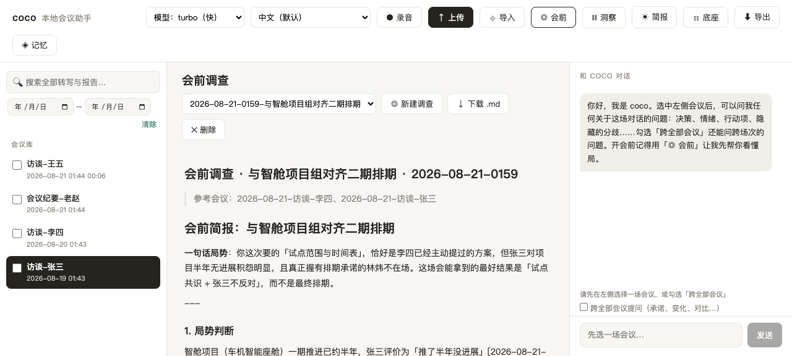
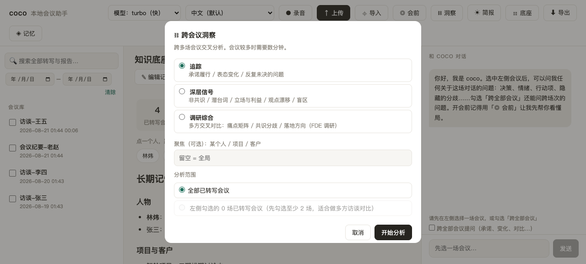
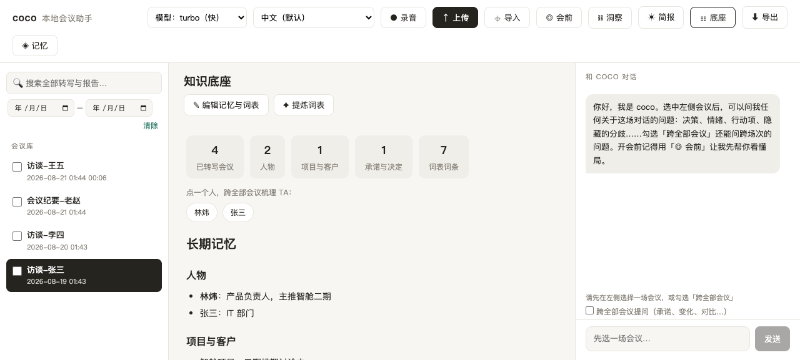

# coco — 本地会议参谋

**录音转写 · 会前调查 · 深层洞察 · 知识沉淀，全部在你自己的电脑上完成。**

[English README → README.md](README.md)

coco 是一个跑在本机的会议 AI 工具（灵感来自 [YouNavi](https://younavi.me)）：
把会议录音、访谈、聊天记录、他人纪要都喂给它，它帮你在**会前看懂局**、
**会后抓住没说破的东西**、并把每一次沟通**沉淀成可复用的认知资产**。

音频不出本机（Whisper 本地转写）；分析默认通过你已登录的 `claude` CLI 完成，不需要额外
API key，没有云端账号，没有订阅；也可以接任何 Anthropic 兼容或 OpenAI 兼容接口
（DeepSeek、OpenAI、本机 Ollama 等）。

界面提供**简体中文、English、français** 三种语言；AI 输出语言可以单独设置。支持 macOS、
Windows、Linux。不能本地转写的电脑一样能用全部分析功能：把任何工具导出的文字稿
（txt / docx / pdf / srt / vtt / json 等）拖进来，或直接粘贴文字。

## 它适合谁

- **顾问 / FDE / 售前**：进入一家新公司，访谈十个人，各说各话——用「调研综合」交叉对比
  各方诉求与痛点，理出共识、分歧和落地方向
- **销售 / 客户负责人**：每次见客户前用「会前调查」过一遍历史——谁承诺过什么、态度怎么变的、
  这次该怎么开场
- **管理者**：跨周例会追踪「谁答应的事有没有下文」，发现反复被搁置的问题
- **任何开很多会的人**：转写、纪要、行动项、日报周报，一条龙

## 界面一览

**会前调查**——先看懂局，再进会。



**跨会议洞察**——三种分析模式，可聚焦某个人/项目，可只分析勾选的几场访谈。



**知识底座**——人物、项目、承诺、词表的自动沉淀总览。点一个人名，跨全部会议梳理 TA。



## 功能全览

### 材料进来

| 方式 | 说明 |
|---|---|
| ● 录音 | 本机麦克风直接录（macOS），停止后自动转写 |
| 拖拽 / ↑ 上传 | 音频、视频，或已有的文字材料，多选、排队 |
| ⌖ 导入 · 本地路径 | 文件或文件夹（文件夹 = 批量）；音频 + 同名转写（Whisper 导出目录）自动配对成一场会议 |
| ⌖ 导入 · 粘贴文本 | 聊天记录、邮件、他人纪要、原始文字稿；SRT / VTT / JSON 内容自动识别并保留时间轴；可标注材料原始日期 |
| `coco watch` | 监控文件夹，新录音自动转写（语音备忘录、Plaud 导出目录） |

**不经转写直接入库的文字格式：** `txt md docx odt pdf rtf html eml csv tsv srt vtt sbv lrc ass ssa json`。
腾讯会议、飞书妙记、讯飞听见、Zoom、Teams、Google Meet、Otter、Fireflies 等工具导出的文字稿
可以原样上传。带时间轴的渲染成与本地转写一致的 `[mm:ss] 文本`；说话人标签（VTT voice 标签、
ASS 角色名、CSV/JSON 的 speaker 列）保留；自动识别 UTF-8 / UTF-16 / GB18030 / Big5，微信、QQ
导出不乱码；Whisper `.tsv` 的毫秒偏移与逐词 JSON 导出都能正确处理。PDF 需要 `pypdf`
（已列入 `requirements.txt`）。

**入库即入记忆**：文字材料和转写一样，自动并入长期记忆、参与所有跨会议分析。

### 转写与校正

- **本地 Whisper**：Apple Silicon 用 mlx-whisper（原生加速，turbo 转 45 分钟会议约 2 分钟）；
  Windows / Linux / Intel Mac 用 faster-whisper（有 NVIDIA 显卡走 CUDA，否则 CPU，慢但可用）。
  turbo 快、large 最准；顶栏随时切换模型与转写语言（自动识别或指定 ISO 码）
- **幻觉抑制**：Whisper 会在静音和噪音处脑补文字（YouTube 式开场白、字幕致谢、单字复读），还会把
  注入的提示词原样吐出来。coco 转写前先裁掉首尾静音，开启 Whisper 自带的静音幻觉阈值，保留每段的置信度，
  转写后再按已知模式清洗。已有转写可在「转写」页签点「✦ 清理」（先预览再应用，原稿备份为
  `transcript.preclean.md`），或用 `coco clean --all --apply`
- **没有引擎也不慌**：不能本地转写的电脑（典型：没装 faster-whisper 的 Windows）一旦有人
  拖入音频，会弹出说明对话框：这台电脑暂时不能转写，录音本身没问题，给出三条路——用其他工具
  转成文字稿再拖进来 / 直接粘贴文字稿 / 安装引擎（附命令）。只有 CPU 的机器首次会提示预计耗时
- **词表**（`memory/glossary.md`）：人名与专有名词的标准写法，格式
  `- 正确写法（误写：错1、错2）｜备注`。正确写法注入转写提示；「✦ 提炼词表」让 AI 从会议历史里
  自动归集
- **✦ 人名与术语校正**：按词表统一修正全部会议转写与报告里的写法；原文自动备份，可逐场恢复原稿
- **✎ 编辑**：转写和报告都可以直接改，后续分析用改过的版本
- **参与人员**：会议标题下多一行「参与人员」（同步写进转写头部），格式「姓名（角色）、姓名（角色）」。
  可手动填写，也可点「✦ 识别」让 AI 从转写里提出建议再确认。之后的每份报告、对话回答和跨会议分析
  都以它为准判断谁说了什么——说话人判断失误改一次即可，不用每份报告重来
- **下载转写**：`.md` / `.txt` / `.srt` / `.vtt` / `.json` 任选

### 单场分析

九个模板，一键生成。每次生成都会立刻新开一个 ⏳ 页签在里面**边生成边显示**（第一个字出来之前显示
「模型正在阅读与思考… N 秒」），其他页签照常可读，切回来继续看。报告可编辑、可下载：

> 纪要 · 行动项 · 情绪曲线 · 张力与分歧 · 认知偏误 · 话题延伸 · 客户跟进 · 招聘评估 · **跟进草稿**

「跟进草稿」直接产出**可发送的跟进消息**（邮件/即时消息，语气匹配双方关系）+ 48 小时行动清单。
右侧对话框可对当前会议自由提问；勾选「跨全部会议」后提问范围扩展到整个会议库。「↓ 导出」把这次对话
保存为 Markdown，选中会议时同时存为该会议的「对话 HH:MM」页签。

### 会前调查（◎ 会前）

填三样：会议主题、参会人、你的目标。coco 自动挑出最相关的历史会议，结合长期记忆与词表生成
会前简报——所有判断标注来源（会议 id + 时间戳），推测明确标「推测」。可选**联网搜索**参会人/
公司的公开信息（结果注明来源；仅 Claude CLI 通道；默认关闭，逐次勾选）。历史简报保存在
`library/_prep/`。

### 跨会议洞察（⛓ 洞察）

| 模式 | 回答的问题 |
|---|---|
| 追踪 | 谁承诺了什么、兑现没有；谁的说法前后变了；哪些问题反复被搁置 |
| 深层信号 | 表面同意实际没同意的地方；潜台词；各方在保护什么、争取什么；观点漂移轨迹；所有人都没提的盲区 |
| 调研综合 | 多方访谈交叉对比：角色图、诉求与痛点矩阵、共识区与分歧区、信息盲区、快赢/中期/长期落地建议（FDE 调研场景） |

范围可选全部会议，或侧边栏勾选的几场；可聚焦某个人/项目/客户。

### 沉淀（越用越懂你）

- **长期记忆**（自动）：每场转写/导入完成后，提取人物、项目与客户、承诺与决定、术语，合并进
  `memory/longterm.md`，注入之后所有分析；同一人表态变化保留轨迹（「原说 X [旧会议] → 现说 Y
  [新会议]」）。合并是**增量**的：模型只输出新增/变化的条目，coco 按名称合并，几秒完成，不再
  每次重写整份文件。「⟲ 压缩长期记忆」按需做一次整体合并压缩
- **日报 / 周报**（☀ 简报）：汇总一天的行动项与洞察；一周的主线、决定、行动项总账、表态变化、
  下周建议。简报也并入长期记忆
- **知识底座**（☷ 底座）：沉淀统计 + 人物点选提问
- 记忆、词表都是可手动编辑的 Markdown；任何自动覆盖前都留 `.bak.md` 备份

### 管理

全局搜索 · 日期筛选与录音日期校准 · 回收站软删除（`library/_trash`）· 单文件下载 · 批量 zip
导出 · 服务重启自动恢复中断的转写队列

## 语言

- **界面语言**：简体中文、English、français。顶栏语言下拉、「⚙ 设置」、URL 加 `?lang=en`、
  命令行 `coco lang zh-CN` 都能切换，选择会记住
- **AI 输出语言**（⚙ 设置）：跟随界面（默认）/ 跟随材料（转写是什么语言就用什么语言）/
  指定某种语言（日语、德语……）。影响报告、简报、洞察、会前调查、对话回答，以及长期记忆和
  词表的写法
- **转写语言**：顶栏单独设置，自动识别或指定 ISO 码
- 切换语言不影响已有会议库：coco 认得所有语言包的记忆/词表章节标题，旧的中文报告文件名也照常
  显示标签

新增语言：复制 `coco/locales/en.json` 为 `<code>.json` 翻译即可（提示词沿用英文并附「用 X 语言
输出」指令；中文输出用中文提示词集）。`python tests/check_i18n.py` 检查键是否齐全。

## AI 模型通道（Claude、DeepSeek、OpenAI、Ollama……）

默认所有分析走已登录的 **Claude Code CLI**。「⚙ 设置」（或 `coco ai`）里可以定义两条通道：

- **主通道**：报告、洞察、会前调查、对话
- **后台通道**：长期记忆合并、词表提炼、人名校正

每条通道三选一：

| 类型 | 适用 |
|---|---|
| `claude-cli` | 已登录的 Claude Code CLI。填上 base URL + API key 后，同一个 CLI 也能连任何 Anthropic 兼容端点（DeepSeek 的 `https://api.deepseek.com/anthropic`），此时 coco 以 `--bare` 启动它（启动不到一秒，而不是几秒） |
| `anthropic` | 直连 Anthropic 兼容的 `/v1/messages`（Anthropic、DeepSeek /anthropic……） |
| `openai` | 直连 OpenAI 兼容的 `/chat/completions`（DeepSeek、OpenAI、本机 Ollama / LM Studio） |

预设会填好 URL 与模型名（DeepSeek 按其 2026 年 8 月文档为 `deepseek-v4-pro` / `deepseek-v4-flash`，
被拒绝时请查最新文档）。「测试连接」发一条最小请求并报告延迟。API key 只存本机
`coco.config.json`（已在 .gitignore），或从环境变量读取。

**怎样用好 DeepSeek 这条通道。** 稳妥的分法：主通道留在 Claude 上（会前、洞察、报告这些你要读的
东西），后台通道交给 DeepSeek。记忆合并、词表提炼、人名校正是频繁、机械、输入很长的任务，换便宜
通道能省额度又不影响你读到的内容。如果主通道也想换 DeepSeek，请在自己的会议上判断：同一份转写
两条通道各跑一次同一模板对比（`coco ai test` 只给延迟，质量要自己读）。两个硬限制：会前调查的
联网搜索只有 Claude CLI 通道有；HTTP 通道直接从 API 流式返回，不经过 CLI 的工具沙箱。每条通道
可设「上下文上限」保护窗口较小的模型。

## 性能

时间花在哪：在本机测得，每次 CLI 往返在拿到第一个字之前有约 5–8 秒的固定开销
（`claude --version` 2.1.246，2026 年 8 月；你的机器数字会不同），之后是模型输出速度。所以 coco：

- **流式输出**：报告、对话、洞察、简报、会前调查边生成边显示；
- **增量合并长期记忆**：只输出几百 token 的变化条目，而不是重写可能有几千行的整份文件；
- 后台任务可走**更快的通道**（Claude CLI 的 `haiku`，或 DeepSeek）；
- 启动 CLI 时不加载 MCP、不给工具、在空目录里运行，避免项目 `CLAUDE.md` 和 MCP 启动拖慢每次分析。

## 安装与启动

**共同前提**：Python 3.10+ · [Claude Code](https://claude.com/claude-code) 已安装并登录
（终端里 `claude` 可用），或在设置里配好 API 通道。Web 界面只监听 127.0.0.1。

### macOS

```bash
git clone https://github.com/cocohahaha/coco.git
cd coco
python3 -m venv .venv
.venv/bin/pip install -r requirements.txt
./run.sh        # 启动并打开浏览器 → http://127.0.0.1:8765
```

以后每次启动：双击 `coco.command`，或再跑 `./run.sh`（重复运行不会重复起服务）。Apple Silicon
自动装 mlx-whisper；首次转写会自动下载 Whisper 模型（turbo 约 1.6GB，large 约 3GB；国内网络
自动切 hf-mirror）。首次录音时 macOS 会请求麦克风权限。

### Windows

1. 安装 [Python 3.10+](https://www.python.org/downloads/)（安装时勾选 **Add python.exe to PATH**）
2. 安装 [Git for Windows](https://git-scm.com/download/win)（Claude Code 依赖它）
3. 安装并登录 [Claude Code](https://claude.com/claude-code)：在终端运行一次 `claude`
4. 下载本仓库（`git clone` 或 GitHub 页面「Code → Download ZIP」解压），**双击 `run.bat`**

首次双击会自动创建虚拟环境并安装依赖（含 faster-whisper，几百 MB），然后启动服务并打开浏览器。
关闭那个黑色窗口就是停止服务。命令行用 `bin\coco.cmd`。

**Windows 上的典型用法：已有录音 → 文字稿 → 上传 → 分析。** 大多数人不需要在自己电脑上跑
Whisper：用腾讯会议、飞书妙记、讯飞听见等工具转成文字稿，导出 `txt / docx / pdf / srt`，拖进
coco。若 faster-whisper 安装失败，`run.bat` 会只装核心依赖，界面收起录音与模型选项，文字稿路线
不受影响。没有 NVIDIA 显卡时本机转写 45 分钟录音需要 10–30 分钟。

### Linux

同 macOS（`python3 -m venv .venv && .venv/bin/pip install -r requirements.txt`，然后
`.venv/bin/python -m coco web --open`）；使用 faster-whisper；网页录音仅 macOS。

## 命令行

界面能做的 CLI 都能做（macOS/Linux 建议 `alias coco="<项目路径>/bin/coco"`；Windows 用
`bin\coco.cmd`）。输出跟随界面语言。

| 命令 | 作用 |
|---|---|
| `coco transcribe <文件…>` | 导入音频/视频转写（`--model turbo/large`） |
| `coco import <文件/文件夹…>` | 导入文字材料（txt/docx/pdf/srt/vtt/json…），不转写 |
| `coco record [标题]` | 麦克风录音，Ctrl+C 停止后转写（macOS） |
| `coco watch <文件夹>` | 监控文件夹，新音频自动转写 |
| `coco list` / `coco show <会议>` | 会议库 / 某条转写 |
| `coco ask "问题" [会议…]` | 对会议提问（流式输出） |
| `coco report <会议> -t <模板>` | 生成报告（`coco templates` 看 id） |
| `coco prep "主题" [--who …] [--goal …] [--web]` | 会前调查 |
| `coco track [焦点] [--mode track\|signals\|synthesis] [--refs a,b]` | 跨会议洞察 |
| `coco brief [日期]` / `coco weekly [日期]` | 日报 / 周报 |
| `coco search <词>` | 全文搜索 |
| `coco glossary [词条] [--extract]` | 查看/追加/AI 提炼词表 |
| `coco clean <会议>\|--all [--apply]` | 清理已有转写里的 Whisper 幻觉（不加 `--apply` 只预览） |
| `coco memory [内容]` | 查看/追加全局记忆 |
| `coco memorize [会议\|--all\|--compact]` | 提取长期记忆 / 压缩整理 |
| `coco lang [代码] [--output …]` | 界面与 AI 输出语言 |
| `coco ai show\|test\|preset\|set\|task` | AI 通道（`--profile fast` 操作后台通道） |
| `coco delete <会议>` · `coco config [键 值]` · `coco web` | 回收站 · 配置 · Web 界面 |

模板与模式 id：`minutes actions mood tension bias topics client hiring followup` ·
`track signals synthesis`；原来的中文名（纪要、追踪……）照样接受。

## 数据与配置

所有数据都是本机磁盘上的普通文件夹和 Markdown，随时可以翻看、备份、迁移：

```
library/<日期-标题>/   每场会议：音频 + transcript.md/json + reports/*.md
library/_briefs/       每日简报            library/_weekly/     周报
library/_tracking/     跨会议洞察报告       library/_prep/       会前调查简报
library/_trash/        回收站
memory/memory.md       全局记忆（手动维护，注入每次分析）
memory/longterm.md     长期记忆（自动提取，可手动修订）
memory/glossary.md     词表（人名与专有名词标准写法）
coco.config.json       配置（含 API key，已在 .gitignore）
```

常用配置（`coco config 键 值`）：`ui_language`（auto / zh-CN / en / fr）、`output_language`
（ui / source / 语言代码）、`whisper_model`、`language`（转写语言）、`beam_size`、
`hallucination_filter`、`transcribe_backend`（auto / mlx / faster / none）、`auto_memory`、`memory_merge`（delta / full）、
`ai_profiles`、`ai_tasks`、`claude_extra_args`、`hf_endpoint`。环境变量 `COCO_ROOT` 可把数据根
目录指到别处；`COCO_LANG` 覆盖 CLI 语言。

## 已知边界

- 本地转写不区分说话人（导入材料里的说话人标签会保留）
- Whisper 的防复读机制使词表提示主要作用于音频开头，全文纠错靠「✦ 校正」完成
- 会前调查的「联网搜索」会把检索词发给搜索引擎——只在需要公开情报时勾选；其余功能均不联网
  （模型下载与你选择的 API 通道除外）
- 网页录音仅 macOS；Windows 请用系统录音机或会议软件录好后上传
- 不支持旧版 `.doc`，请另存为 `.docx` 或 `.txt`；扫描版 PDF 需先 OCR

## 开发自检

```bash
.venv/bin/python tests/smoke.py      # 约 150 项断言：临时 COCO_ROOT + stub claude
.venv/bin/python tests/check_i18n.py # Python / 前端用到的每个键在三个语言包里都存在
```

都不碰真实数据、不消耗模型额度（Windows：`.venv\Scripts\python tests\smoke.py`）。

## 更新日记

### 2026-08-26 · 多语言、流式输出、可插拔 AI 通道
- **三种界面语言**（简体中文、English、français），每条消息、文件标签、下载文件名都按请求语言
  输出；**AI 输出语言**独立于界面（跟随界面 / 跟随材料 / 指定语言）；切换语言不影响已有会议库
- **流式输出**：报告、对话、洞察、简报、会前调查边生成边显示
- **长期记忆增量合并**（几秒完成，不再整份重写）+ 按需「压缩整理」
- **AI 通道**：Claude CLI（默认）、Anthropic 兼容与 OpenAI 兼容 HTTP 接口（DeepSeek、OpenAI、
  Ollama……）；主通道 / 后台通道按任务分配；连接测试；预设
- **更多文字稿格式**：pdf、odt、rtf、html、eml、csv/tsv、sbv、lrc、ass/ssa，JSON 识别更宽
  （说话人、毫秒偏移、逐词导出）；粘贴的 SRT/VTT/JSON 自动识别；转写可下载为 md/txt/srt/vtt/json
- **无引擎时更友好**：拖入音频弹出说明对话框，CPU 转写耗时提示，一键跳到「粘贴文字稿」
- claude CLI 以不加载 MCP、不给工具、空工作目录的方式启动
- 冒烟测试增至约 150 项，新增语言包完整性检查

### 2026-08-25 · Windows 支持
- `run.bat` 一键装环境并启动；`bin\coco.cmd`；claude CLI 按 PATHEXT 定位；子进程强制 UTF-8
- 转写引擎抽象：Apple Silicon 用 mlx-whisper，其他平台用 faster-whisper（CUDA / CPU）
- docx 导入；界面按本机能力自适应

### 2026-08-24
- 周报；README 重写为完整产品文档

### 2026-08-21 · 从「会后纪要」到「会前-会中-会后-沉淀」全流程
- 会前调查、词表、洞察三模式（追踪 / 深层信号 / 调研综合）、文字材料归集、知识底座、
  跟进草稿模板、冒烟测试

### 2026-06 · 首批版本
- 本地 Whisper 转写、分析模板、对话问答、每日简报、长期记忆、跨会议追踪、搜索、回收站、
  编辑、人名校正
